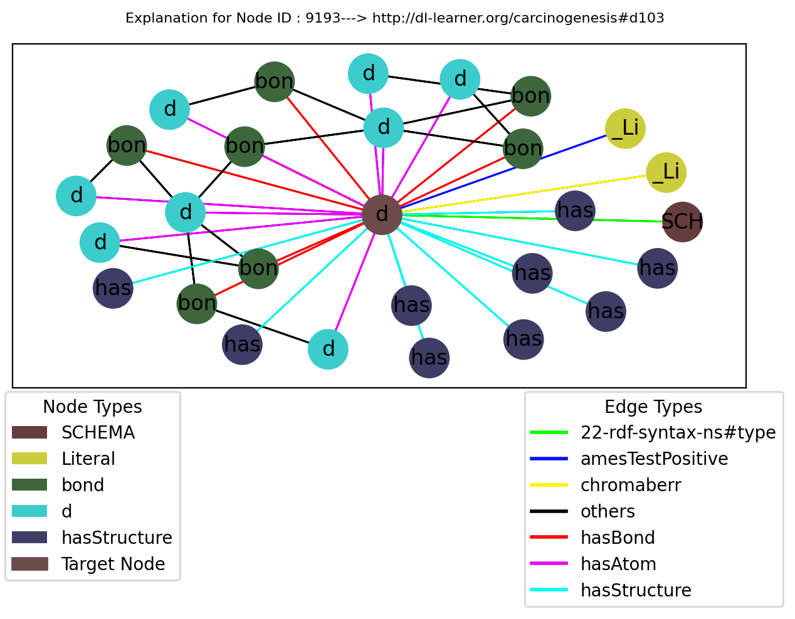
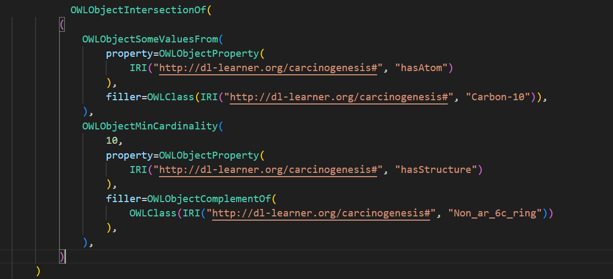

# EDGE: Evaluation of Diverse Knowledge Graph Explanations

The **EDGE** framework represents a novel approach in evaluating explanations produced by various node classifiers on knowledge graphs. Standing for "Evaluation of Diverse Knowledge Graph Explanations," EDGE integrates an array of advanced Graph Neural Networks (GNNs), sub-graph-based GNN explainers, logical explainers, and a comprehensive set of evaluation metrics. This framework is designed to automate the evaluation process, efficiently handling methods within its scope and delivering results in a clear, structured manner. The primary goals of EDGE are to incorporate cutting-edge node classifiers from existing literature, to provide a quantitative assessment of different explainers using multiple metrics, to streamline the evaluation process, and to conduct evaluations using real-world datasets.


## Logical Approaches
1. **EvoLearner:** [EvoLearner: Learning Description Logics with Evolutionary Algorithms](https://arxiv.org/abs/2111.04879)
2. **CELOE:**  [Class Expression Learning for Ontology Engineering](https://www.sciencedirect.com/science/article/pii/S1570826811000023)

The logical approaches in the EDGE framework, including EvoLearner and CELOE, were adapted from [OntoLearn](https://github.com/dice-group/Ontolearn).


## Sub-graph-based Approaches
1. **PGExplainer:**  [Parameterized Explainer for Graph Neural Network](https://arxiv.org/abs/2011.04573)
2. **SubgraphX:**  [On Explainability of Graph Neural Networks via Subgraph Explorations](https://arxiv.org/abs/2102.05152)

The sub-graph-based approaches in the EDGE framework, including PGExplainer and SubgraphX, were adapted from the [DGL (Deep Graph Library)](https://docs.dgl.ai/en/1.1.x/api/python/nn-pytorch.html).

These explainers collectively enhance the capability of the EDGE framework to provide comprehensive and insightful evaluations.


## Datasets
[A Collection of Benchmark Datasets for Systematic Evaluations of Machine Learning on the Semantic Web](https://link.springer.com/chapter/10.1007/978-3-319-46547-0_20)
1. **Mutag** [Structure-activity relationship of mutagenic aromatic and heteroaromatic nitro compounds](https://pubmed.ncbi.nlm.nih.gov/1995902/)
2. **AIFB** [Kernel Methods for Mining Instance Data in Ontologies](https://link.springer.com/chapter/10.1007/978-3-540-76298-0_5)
3. **BGS** [British Geological Survey](https://www.bgs.ac.uk/datasets/bgs-geology-625k-digmapgb/)


## Installation Guide for the EDGE Framework

Follow these steps to set up the EDGE environment on your system:

### Step 1: Clone the EDGE Repository

First, clone the EDGE repository from GitHub using the following command:

```shell
git clone https://github.com/ds-jrg/EDGE.git
```

### Step 2: Install Conda

If you don't have Conda installed, download and install it from [Anaconda's official website](https://www.anaconda.com/products/individual).


### Step 3: Create the Conda Environment

```shell
conda create --name edge python=3.10 && conda activate edge
```


### Step 5: Install Dependencies

Navigate inside the EDGE directory using ( `cd EDGE ` ). Ensure you have a `requirements.txt` file in your project directory. To install the required dependencies, run:

```shell
pip install -r requirements.txt
```

This command will automatically install all the libraries and packages listed in your `requirements.txt` file. Based on your GPU / CPU devices, install the suitable version of DGL from official [DGL website](https://www.dgl.ai/pages/start.html). The experiments were carried out with the following version.
```shell
conda install -c dglteam/label/th23_cu121 dgl
```
After completing these steps, your EDGE environment should be set up with all the necessary dependencies, except for DGL library.

## Dataset Preprocessing
The datasets for the sub-graph explainers are automatically downloaded and processed by the DGL library. However, the Knowledge Graphs for the logical explainers need to be created manually. For convenience, we provide pre-processed Knowledge Graphs that were generated using the same data sources, specifically the files from the DGL distribution. These pre-processed Knowledge Graphs can be used directly to start and run the explainers. They are available in the [KGs.zip](KGs.zip). file. To unzip and place them in the `data/KGs` folder, use the following command:
```shell
mkdir -p data/KGs && unzip KGs.zip -d data/KGs/ 
```
If you wish to re-create the Knowledge Graphs, feel free to follow the steps below:
<details><summary> Click me! </summary>
### Installing the ROBOT Tool

For converting N3/NT files to the OWL file format within the EDGE framework, the ROBOT (RObotic Batch Ontology) tool is required. However, if you want to use the Knowledge Graph data that are readily avilable, you can skip the installation of ROBOT library and also the preprocessing steps.

Download the ROBOT tool from its official website for the latest release and installation instructions:

[ROBOT Official Website](http://robot.obolibrary.org/)

Follow the instructions on the website to download and install ROBOT. Ensure it's properly installed and configured on your system for use with the EDGE framework.


If you have a linux based system, you can also easily execute all the preprocessing steps using a single script. First, provide the required permissions to the preprocessing script. Then execute the script.
```shell
chmod +x preprocess.sh
```

```shell
./preprocess.sh
```
</details>

## Example Commands for Using the EDGE Framework

Below are some example commands to illustrate how to use the EDGE framework. These examples assume you have already set up the environment per the installation guide.


To train models with specific models and/or datasets, use the `--train` flag along with `--model`, `--explainers`  and `--datasets` flags as needed. See the examples below.

- Training all combination of explainers and datasets for 5 Runs with default RGCN model, use the command:
  ```shell
  python main.py --train 
  ```

- Training specific explainers:
  ```shell
  python main.py --train  --explainers PGExplainer EvoLearner 
  ```

- Training models on specific datasets:
  ```shell
  python main.py --train --datasets mutag bgs
  ```

- Combining specific explainers and datasets:
  ```shell
  python main.py --train --explainers SubGraphX CELOE --datasets aifb
  ```
- Training specific GNN Model(The RGCN model is used by default and does not need to be explicitly mentioned.):
  ```shell
  python main.py --train  --model RGAT 
  ```


If you wisth to train for all the explainers and datasets, you can simply omit the tags from the arguments. The default number of runs is 5 and the default GNN Model is RGCN.

- Training for certains number of runs for all explainers-dataset combo:
  ```shell
  python main.py --train  --num_runs 3 
  ```
There is also support for prining results, in which you can specify the model you want to print results for, defaults to "RGCN"

- Print Results
  ```shell
  python main.py --print_results
  ```

- Print Results for specific using the model 
  ```shell
  python main.py --print_results --model RGAT
  ```

## Example Explanations
Here are some example explanations from the different explaniers.

- Sub-graph explanation of a node of Mutag Dataset
 

- Logical explanation as OWL Class Expression


- Logical Explanation in DL Syntax
```
(∃ hasAtom.Carbon-10) ⊓ (≥ 10 hasStructure.(¬Non_ar_6c_ring))
```

## RGAT Results
The RGAT results can be printed on the terminal using:
```shell
python main.py --print_results --model RGAT
```
If you just want to observe the results, <details><summary> Click me! </summary>

| Model | Dataset | Pred Accuracy | Pred Precision | Pred Recall | Pred F1 Score | Exp Accuracy | Exp Precision | Exp Recall | Exp F1 Score |
|---|---|---|---|---|---|---|---|---|---|
| CELOE | aifb | 0.722 | 0.647 | 0.733 | 0.688 | 0.744 | 0.694 | 0.745 | 0.718 |
| EvoLearner | aifb | 0.65 | 0.545 | 0.987 | 0.702 | 0.672 | 0.574 | 0.986 | 0.724 |
| PGExplainer | aifb | 0.667 | 0.605 | 0.68 | 0.634 | 0.689 | 0.647 | 0.696 | 0.666 |
| SubGraphX | aifb | 0.656 | 0.595 | 0.68 | 0.628 | 0.667 | 0.624 | 0.683 | 0.647 |
| CELOE | bgs | 0.517 | 0.409 | 0.9 | 0.563 | 0.531 | 0.436 | 0.889 | 0.583 |
| EvoLearner | bgs | 0.531 | 0.418 | 0.92 | 0.575 | 0.559 | 0.454 | 0.931 | 0.609 |
| PGExplainer | bgs | 0.538 | 0.38 | 0.54 | 0.441 | 0.566 | 0.442 | 0.592 | 0.497 |
| SubGraphX | bgs | 0.524 | 0.381 | 0.6 | 0.465 | 0.566 | 0.445 | 0.662 | 0.529 |
| CELOE | mutag | 0.703 | 0.718 | 0.92 | 0.804 | 0.632 | 0.617 | 0.897 | 0.726 |
| EvoLearner | mutag | 0.685 | 0.707 | 0.92 | 0.795 | 0.632 | 0.612 | 0.904 | 0.725 |
| PGExplainer | mutag | 0.456 | 0.663 | 0.373 | 0.475 | 0.691 | 0.889 | 0.587 | 0.681 |
| SubGraphX | mutag | 0.432 | 0.635 | 0.347 | 0.445 | 0.674 | 0.88 | 0.565 | 0.66 |

</details>

## Cite Us !!

If you have referred to our work or found it helpful, please consider citing it using the following entry:

```
@inproceedings{Sapkota2024EDGE,
  author       = {Rupesh Sapkota and
                  Dominik Köhler and
                  Stefan Heindorf},
  title        = {EDGE: Evaluation Framework for Logical vs. Subgraph
Explanations for Node Classifiers on Knowledge Graphs},
  booktitle    = {{CIKM}},
  publisher    = {{ACM}},
  year         = {2024}
}
```

## Contact Us
For any queries or collaborations, please contact ```rupezzz@mail.uni-paderborn.de``` . If you have found any bugs raise an Issue or  if want to contribute, open a new feature branch and create a Pull Request.